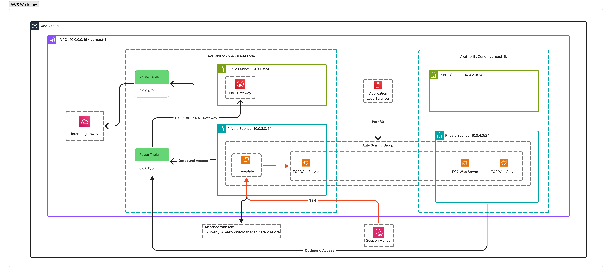
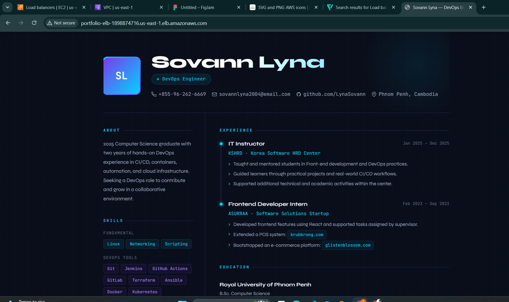

# Scalable AWS Portfolio Infrastructure with Terraform

This project provisions a **secure and scalable AWS infrastructure** for hosting a personal portfolio website using **Infrastructure as Code (Iac)** with Terraform.

The architecture follows **DevOps best practices** by separating public and private resources, restricting direct internet access to backend servers, and enabling automatic scaling.

---

## Architecture Overview

The infrastructure is deployed inside **Amazon Virtual Private Clound** with the following structure:



### Key Services

- Amazon EC2 - Hosts the portfolio web servers
- Elastic Load Balancing - Distributes incoming traffic
- AWS Auto Scaling - Automatically scales EC2 instances
- Amazon Virtual Private Cloud - Provides isolated netowrk infrastructure

---

## Security Design

Security is implemented using multiple layers:

- **Bastion Host**
  - Allow controlled SSH acccess to private instances.
- **Load Balancer**
  - Handles all public HTTPS traffic.
- **Private Web Service**
  - No public IP addresses.
  - Accessible only through the load balancer (port 80) or bastion host (port 22).

---

## Features

- Infrastructure fully managed with **Terraform**
- Isolated networking using VPC
- Secure private web servers
- Bastion Host for controlled access
- Auto Scaling for high availability
- Clean and simple architecture suitable for learning DevOps practices

---

## Deployment

Initialze Terraform

```bash
terraform init
```

Review the execution plan

```bash
terraform plan
```

Apply the infrastructure

```bash
terraform apply
```

---

## Purpose

This project demonstrates how to design and deploy a **secure**, **scalable AWS network architecture** using Terraform while following **common DevOps infrastructure patterns**.

<div align="center">  </div>
